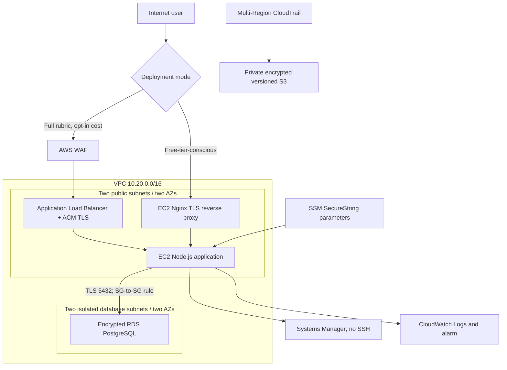

# AWS architecture and rubric mapping

## Architecture

Figure 1: Implemented low-cost architecture plus optional ALB/WAF entry path.

The database tier is isolated and has no internet route or public address. Stateful security groups allow PostgreSQL only from the application security group. Stateless NACLs permit only web/response traffic in public subnets and PostgreSQL/response traffic in database subnets. EC2 requires IMDSv2 and has encrypted EBS. RDS uses encrypted storage, seven-day automated backups, TLS certificate verification, and two-subnet placement. Multi-AZ is intentionally disabled in the free-tier-conscious implementation because a standby database incurs additional usage; the report's target design should show Multi-AZ as the production recommendation.

## Legacy risks mapped to controls

| Legacy risk | Severity | AWS/application mitigation |
| --- | --- | --- |
| Single server and database are directly exposed | High | VPC tier separation, isolated DB subnets, SG-to-SG 5432 rule, NACLs, non-public RDS |
| Shared administrator/SSH credentials | High | EC2 IAM role, least-privilege inline policy, SSM Session Manager, no port 22 |
| Plaintext credentials in configuration | High | Generated secrets in SSM SecureString, root-only environment file, no secrets in Git |
| Unencrypted disk/database and network traffic | High | Encrypted EBS/RDS/S3 plus verified PostgreSQL TLS and HTTPS |
| Manual patching and vulnerable web requests | High | Amazon Linux update bootstrap, input validation, parameterized SQL, Helmet/rate limits; optional managed WAF rules |
| Missing logs and incident detection | High | Multi-Region CloudTrail with log validation, CloudWatch logs/alarm, database audit table |
| No reliable backup/disaster recovery | High | Seven-day RDS automated backups, S3 versioning, two-AZ subnet design; Multi-AZ recommended for production |
| Broad database privileges | Medium | Separate generated `app_service` login, application RBAC, database roles/views/RLS, restricted RDS SG |

## Secure migration sequence

1. Inventory data and dependencies; freeze schema changes and take/checksum a local backup.
2. Deploy VPC, IAM, logging, encrypted RDS, and EC2 using Terraform with WAF/ALB initially disabled for the cost-controlled test.
3. Transfer the database through a TLS connection, validate row counts/checksums, and keep the old database read-only during verification.
4. Retrieve generated secrets through the EC2 role, initialize the schema once, and test role-based application flows.
5. Lower DNS TTL, perform a short final write freeze/delta migration, smoke-test, and switch users to AWS.
6. Monitor application logs, CloudTrail, RDS health, and authentication failures. Keep a documented rollback window before securely retiring the legacy host.

For a production-grade submission diagram, show two application instances across AZs behind ALB and RDS Multi-AZ. The supplied one-instance/single-AZ runtime is the explicit cost-security trade-off requested for a small classroom demonstration.
