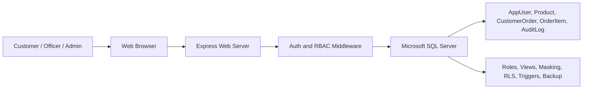
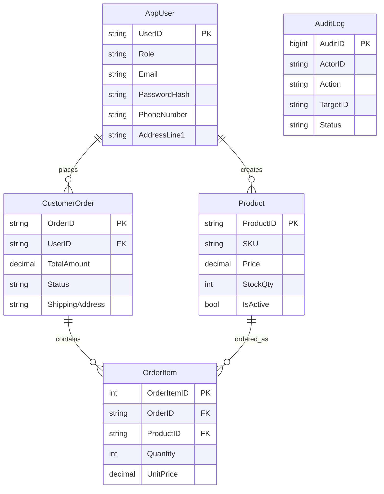

# CCS6344 Assignment 1 Report Outline

## Cover Page

CCS6344 T2610 Assignment 1 Submission  
Group Name: Group 1  
Name 1 / Student ID  
Name 2 / Student ID  
Name 3 / Student ID  
YouTube Link: paste presentation link here

## Task 1: Proposal

### Objectives

The Secure Fashion E-Commerce Management System protects customer personal data, fashion product inventory, orders, and administrative records in an SQL-backed web application. The project objectives are:

1. Provide secure login and role-based workflows for customers, inventory officers, and administrators.
2. Store product, customer, order, and audit data in a relational SQL Server database.
3. Reduce internal and external attack risks using authentication, least privilege, parameterized SQL, masking, auditing, backups, and encryption planning.
4. Produce evidence for database security tests required by the assignment.

### Business Model

SecureStyle is an online boutique that sells clothing, bags, and fashion accessories. Customers browse fashion products and place orders. Inventory officers maintain product records, pricing, categories, and stock quantity. Administrators supervise users, security logs, and product deletion. Revenue comes from product sales; trust depends on protecting customer identity, address, order, and payment-related data.

### Proposed Implementation

The application uses a Node.js Express web server connected to Microsoft SQL Server. The browser UI calls JSON APIs. SQL Server stores all core business data and enforces constraints, views, masking, triggers, row-level security, and audit records.

### Hardware and Software

| Layer | Proposed Choice | Reason |
| --- | --- | --- |
| Programming language | JavaScript on Node.js | Lightweight, fast web APIs, broad security middleware support |
| Database | Microsoft SQL Server | Supports T-SQL, roles, views, dynamic data masking, RLS, TDE, backup |
| Server OS | Windows Server or Windows 11 for development | Suitable for SQL Server and IIS/reverse proxy deployment |
| Web server | Node.js Express behind IIS/Nginx reverse proxy | Express handles app logic; reverse proxy can terminate HTTPS |
| Security libraries | Helmet, express-rate-limit, bcryptjs, jsonwebtoken, zod, mssql | Covers HTTP headers, brute-force control, password hashing, sessions, validation, parameterized SQL |

### System Design

### Database Design

### SQL Database Security Plan

The database security plan uses least privilege roles, parameterized queries, password hashing, dynamic data masking for personal data, SQL views for staff access, row-level security for customer orders, triggers for database audit trails, CHECK constraints for data integrity, and backup/TDE planning.

## Task 2: Implementation

Screenshot checklist:

1. Run `sql/01_schema.sql` and capture successful table creation.
2. Run `sql/02_seed.sql` after replacing the bcrypt hash and capture inserted sample rows.
3. Run `sql/03_security.sql` and capture roles/views/triggers/security policy creation.
4. Start the app and capture login.
5. Insert a new product using the product form.
6. Delete one existing product as Admin.
7. Insert another new product.
8. Load audit logs to prove the actions were recorded.
9. Load masked customers to prove sensitive data is hidden for staff.

## Task 3: STRIDE and DREAD

| STRIDE Threat | Example Risk | Control |
| --- | --- | --- |
| Spoofing | Attacker logs in as staff | bcrypt passwords, signed HTTP-only session cookie, rate-limited login |
| Tampering | User changes product price directly | RBAC, server-side validation, parameterized SQL, database constraints |
| Repudiation | Staff denies deleting product | AuditLog table and database triggers |
| Information Disclosure | Staff sees full customer phone/address | Dynamic data masking, views, least privilege roles |
| Denial of Service | Brute-force or oversized requests | Rate limiting, JSON body size limit, indexed queries |
| Elevation of Privilege | Customer calls admin delete API | `requireAuth(["Admin"])`, database DENY permissions |

| Threat | Damage | Reproducibility | Exploitability | Affected Users | Discoverability | Total |
| --- | ---: | ---: | ---: | ---: | ---: | ---: |
| SQL injection against product insert | 8 | 6 | 5 | 7 | 6 | 32 |
| Credential brute force | 7 | 7 | 6 | 8 | 7 | 35 |
| Unauthorized product deletion | 6 | 5 | 4 | 5 | 5 | 25 |
| Customer data disclosure | 8 | 5 | 5 | 8 | 6 | 32 |
| Order tampering | 7 | 5 | 5 | 6 | 5 | 28 |

After controls, risk is reduced because user input is parameterized, routes enforce roles, SQL permissions deny direct table access, and sensitive data is masked.

## Task 4: PDPA 2010

| Personnel | PDPA Category | Responsibility |
| --- | --- | --- |
| Customer | Data subject | Provides personal data for purchases |
| SecureCart company/admin | Data user | Determines purpose of collection and processing |
| Inventory officer | Authorized employee of data user | Processes product and limited customer delivery data |
| Hosting/database provider | Data processor | Processes data on behalf of the company |

| Lifecycle Stage | PDPA Alignment | Compliance Action | Overseer |
| --- | --- | --- | --- |
| Collection | General and Notice principles | Show purpose for account/order data collection | Admin/Data Protection Lead |
| Storage | Security principle | Hash passwords, mask personal data, restrict SQL permissions | Database Administrator |
| Use | Purpose limitation | Use data only for order processing, delivery, and support | Operations Manager |
| Disclosure | Disclosure principle | Share only necessary delivery data with authorized parties | Admin |
| Retention | Retention principle | Remove inactive accounts/orders after retention period | Database Administrator |
| Access/Correction | Access principle | Allow customer profile review and correction request | Customer Support |
| Disposal | Security principle | Secure deletion and backup expiry | Database Administrator |

Relevant penalties from PDPA 2010 include:

| Non-compliance | Penalty |
| --- | --- |
| Breach of the seven Personal Data Protection Principles in sections 6 to 12 | Fine up to RM300,000, imprisonment up to 2 years, or both |
| Processing personal data without required registration certificate | Fine up to RM500,000 |
| Continuing to process data after registration revocation | Fine up to RM500,000, imprisonment up to 3 years, or both |
| Failure to comply with applicable code of practice | Fine up to RM100,000, imprisonment up to 1 year, or both |
| Unlawful collection/sale of personal data | Fine up to RM500,000, imprisonment up to 3 years, or both |

## Task 5: Security Measures Implemented

1. SQL parameterization with the `mssql` request input API.
2. Role-based route authorization for Customer, InventoryOfficer, and Admin.
3. SQL Server roles and GRANT/DENY permissions.
4. Dynamic data masking for phone, address, and shipping address.
5. Row-level security policy for customer order access.
6. AuditLog table and triggers for product/order changes.
7. bcrypt password hashing.
8. HTTP-only, SameSite session cookie.
9. Helmet HTTP security headers.
10. Login rate limiting.
11. CHECK constraints for role, price, stock, quantity, and order status.
12. Backup script with checksum and compression.
13. TDE implementation notes for database-at-rest encryption.

## Task 6: Presentation

Suggested 10-minute structure:

| Time | Presenter | Content |
| --- | --- | --- |
| 0:00-1:30 | Member 1 | Topic, objectives, business model, architecture |
| 1:30-3:30 | Member 1 | Database design and SQL schema |
| 3:30-5:30 | Member 2 | App demo: login, insert, delete, insert |
| 5:30-7:30 | Member 2 | Security controls and audit evidence |
| 7:30-9:00 | Member 3 | STRIDE/DREAD and PDPA mapping |
| 9:00-10:00 | Member 3 | Conclusion and contributions |

## References

1. Department of Personal Data Protection Malaysia, Personal Data Protection Act 2010 [Act 709], official PDF: https://www.pdp.gov.my/ppdpv1/wp-content/uploads/2024/07/UNDANG-UNDANG-MALAYSIA_AKTA_PERLINDUNGAN_DATA_PERIBADI_2010_709_MALAY_AND-ENG_V2022.pdf
2. Department of Personal Data Protection Malaysia, Introduction to PDPA and data controller responsibilities: https://www.pdp.gov.my/ppdpv1/en/introduction/
