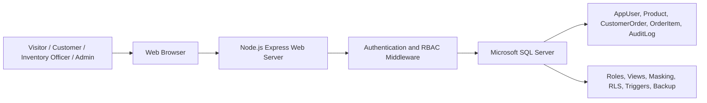
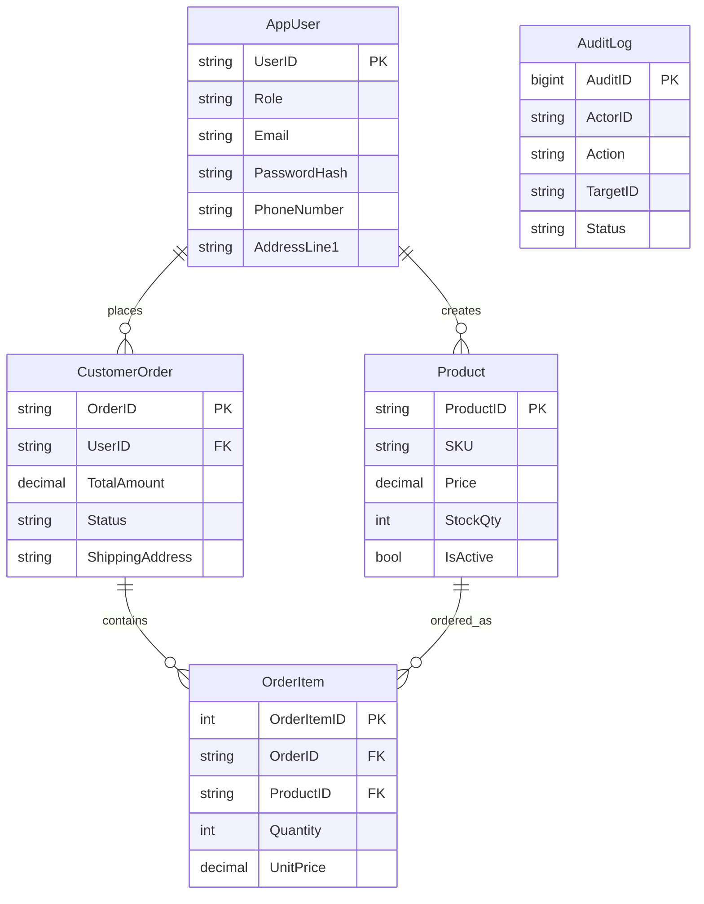

# CCS6344-DATABASE AND CLOUD SECURITY

## Assignment 1: Database Security

Trimester 2610  
By Group 19

Dr. Navaneethan A/L C. Arjuman

Lecture session: TC1L

| Name | ID |
| --- | --- |
| Willie Teoh Chin Wei | 1211106712 |
| Lam Rong Yi | 1211107112 |
| Lee Yu Jie | 241UC24181 |

Video Link:  
GitHub Link: https://github.com/WANNABE003/Database-Cloud-Security-TC1L-G19

## Table of Contents

1. Proposal of the Application  
   1.1 Objective  
   1.2 Proposed Design and Implementation of the Application  
   1.3 Proposed Hardware and Software to Develop the Application  
   1.4 System Design and Database Design  
   1.5 Securing Database  
2. Implementation of the Application using SQL Database  
   2.1 SQL Database Design  
   2.1.1 AppUser Table  
   2.1.2 Product Table  
   2.1.3 CustomerOrder Table  
   2.1.4 OrderItem Tables  
   2.1.5 AuditLog Table  
3. Threat Modelling  
4. PDPA 2010  
   4.1 Categorization with PDPA for Personnel  
   4.2 Data Lifecycle Mapping PDPA 2010 Requirement  
5. Security Measures Implementation  

# Secure Fashion E-Commerce Management System

## 1. Proposal of the Application

### 1.1 Objective

Primary Goal: To develop a secure web-based fashion e-commerce management system using a SQL database.

Key objectives:

1. To protect customer personal data, order records, and fashion product inventory.
2. To ensure confidentiality, integrity, and availability using database security controls.
3. To implement role-based access for customers, inventory officers, and administrators.
4. To apply SQL Server security features such as roles, views, dynamic data masking, row-level security, triggers, auditing, and backup.
5. To align the handling of customer personal data with PDPA 2010 requirements.

### 1.2 Proposed Design and Implementation of the Application

The Secure Fashion E-Commerce Management System, named SecureStyle, is designed for an online boutique that sells clothing, bags, and fashion accessories. The system supports three main user roles: Customer, Inventory Officer, and Admin.

The system consists of the following key components:

**Login-First Shopping Interface**  
Users first see a dedicated sign-in and registration screen. Navigation and logout controls are hidden until authentication. After authentication, customers can browse active fashion products through a storefront-style catalog. Staff roles are shown only their inventory and security tools. This makes the system behave like a real e-commerce website while keeping catalog actions, checkout, and staff functions protected by role.

**User Login System**  
Users first enter a dedicated login screen with demo role shortcuts. They authenticate using email and password. Passwords are compared against bcrypt password hashes stored in the SQL database. After successful login, the system assigns access based on the user role and displays only the functions allowed for that role.

**Customer Registration System**  
New shoppers can register a customer account by entering their name, email, password, phone number, and delivery address. The backend validates the registration data, hashes the password using bcrypt, stores the account as a Customer role in SQL Server, and records the registration activity in the audit log. Public registration is limited to customers only; inventory officer and admin accounts remain controlled by the system owner.

**Fashion Inventory Management**  
Inventory officers can add fashion products such as dresses, blazers, skirts, bags, and accessories. Admin and inventory officer users can approve or reject pending customer orders. Admin users can also reduce product stock by a selected quantity and the system removes the product from the active catalog when stock reaches zero.

**Customer Cart and Order Management**  
Customers can add products to a cart, enter a shipping address, and place orders. New orders are stored as Pending until an admin or inventory officer approves or rejects them. Only pending orders show approval actions; completed orders display their final status.

**Security Evidence Dashboard**  
Admins can view audit logs. Authorized staff can view masked customer records to demonstrate Dynamic Data Masking and least privilege access. Admins also have a separate user management panel for editing user details, deactivating accounts, and resetting passwords when support is needed.

The system design contains three key role-based modules:

1. Customer Module: Allows shoppers to register, sign in, browse fashion products, add products to cart, and place orders.
2. Inventory Officer Module: Allows staff to add and manage fashion product stock and approve or reject pending orders.
3. Admin Module: Allows administrators to approve or reject pending orders, reduce or delete product stock, edit/deactivate user accounts, and monitor audit logs.

Security evidence such as audit logs and masked customer data is included under the Admin and authorized staff functions. It is a security feature of the system, not a separate user role.

### 1.3 Proposed Hardware and Software to Develop the Application

The proposed technologies used in this application are as follows:

| Component | Proposed Technology | Justification |
| --- | --- | --- |
| Frontend | HTML, CSS, JavaScript | Storefront catalog, cart, checkout, inventory, and security evidence interface |
| Backend | Node.js with Express.js | Handles API routing, authentication, validation, and database communication |
| Database | Microsoft SQL Server | Supports SQL roles, views, masking, row-level security, triggers, backup, and encryption |
| Database Tool | SQL Server Management Studio (SSMS) | Used to run SQL scripts, inspect tables, and capture database evidence |
| Server OS | Windows Server or Windows VM in Oracle VirtualBox | Suitable for SQL Server, SSMS, and assignment demonstration |
| Container Option | Docker | Provides repeatable SQL Server and application environment |
| Security Libraries | bcryptjs, jsonwebtoken, helmet, express-rate-limit, zod, mssql | Used for password hashing, sessions, headers, brute-force protection, validation, and parameterized SQL |

### 1.4 System Design and Database Design

#### System Design

The system uses a three-tier architecture. The browser provides role-specific storefront, cart, checkout, inventory management, and security evidence interfaces. The Node.js Express server manages business logic and security checks, while Microsoft SQL Server stores application data.

Figure 1.4.1: System architecture for SecureStyle.

#### Database Design

The database has the following structure:

Key tables:

1. AppUser table: Stores user details, roles, contact information, addresses, and password hashes.
2. Product table: Stores fashion product details such as name, SKU, price, stock quantity, category, and active status.
3. CustomerOrder table: Stores order details including customer, total amount, order status, and masked shipping address.
4. OrderItem table: Stores products and quantities linked to each order.
5. AuditLog table: Logs user actions such as login, product creation, product stock reduction/deletion, order creation, order approval/rejection, and user management.

Figure 1.4.2: ERD for SecureStyle database.

### 1.5 Securing Database

The following practices are implemented to secure the SQL database:

**Authentication and Authorization**  
The application validates users through email and password login. Role-based access ensures that customers, inventory officers, and admins can only access functions assigned to their roles.

**Password Hashing**  
User passwords are hashed using bcrypt before storage. This prevents plaintext password exposure if the database is compromised.

**Role-Based Access Control (RBAC)**  
The backend uses role checks such as Admin-only stock reduction/deletion and user management access, plus InventoryOfficer/Admin product insert access.

**SQL Roles and Permissions**  
SQL Server roles are created for CustomerRole, InventoryOfficerRole, and AdminRole. GRANT and DENY permissions restrict direct table access.

**Row-Level Security (RLS)**  
RLS is used to restrict customer order visibility so customers can only access their own orders, while admins and inventory officers can view orders for approval and operational review.

**Dynamic Data Masking (DDM)**  
Sensitive fields such as phone number, address, and shipping address are masked to reduce unnecessary exposure.

**SQL Injection Prevention**  
The application uses parameterized SQL queries through the `mssql` driver instead of string-concatenated SQL.

**Auditing and Triggers**  
The AuditLog table records important activities such as registration, login, product creation, product stock reduction/deletion, order creation, order approval/rejection, and user management. SQL triggers log product and order changes for accountability.

**Backup**  
The database backup command creates a recoverable database backup with checksum and compression.

**Transparent Data Encryption (TDE) Plan**  
TDE is included as a database-at-rest encryption plan. It protects database files if unauthorized access occurs at the storage level.

## 2. Implementation of the Application using SQL Database

The application is implemented as a web server connected to Microsoft SQL Server. The system uses SQL scripts to create tables, insert seed data, and apply database security controls.

### 2.1 SQL Database Design

The application uses a securely designed SQL database with relational tables, primary keys, foreign keys, constraints, masking, views, triggers, and audit logs.

Figure 2.1: Screenshot of database tables in SSMS.

### 2.1.1 AppUser Table

The AppUser table stores registered users. It includes UserID, role, email, name, phone number, address, password hash, account status, and timestamps. Passwords are not stored in plaintext. Sensitive personal information is protected using Dynamic Data Masking.

Figure 2.1.1: Screenshot of AppUser table structure or sample records.

### 2.1.2 Product Table

The Product table stores fashion product information such as product ID, product name, SKU, price, stock quantity, category, active status, and creator ID. The table uses constraints to prevent invalid price and stock values. Active products are displayed in the storefront catalog after login, while product creation and stock deletion remain restricted by role.

Figure 2.1.2: Screenshot of Product table.

### 2.1.3 CustomerOrder Table

The CustomerOrder table records customer orders, total amount, order status, and masked shipping address. Each order is linked to the customer account that created it. Orders start as Pending and can be approved or rejected by authorized staff. Once an order is approved or rejected, the system displays the final status instead of showing approval buttons.

Figure 2.1.3: Screenshot of CustomerOrder table.

### 2.1.4 OrderItem Tables

The OrderItem table stores the ordered products, quantity, and unit price. Foreign keys maintain relationships between orders and products. The cart interface submits customer orders through the existing order API.

Figure 2.1.4: Screenshot of OrderItem table.

### 2.1.5 AuditLog Table

The AuditLog table records key actions such as customer registration, login attempts, product creation, product stock reduction/deletion, order creation, order approval/rejection, and user update/deletion. It stores the actor, role, action, target, status, timestamp, and IP address.

Figure 2.1.5: Screenshot of AuditLog table.

## 3. Threat Modelling

The system is evaluated using STRIDE and DREAD threat modelling.

| Risk | Category | Example / Mitigation Description |
| --- | --- | --- |
| Credential Spoofing via Login | S | An attacker attempts to impersonate an admin or inventory officer by guessing credentials. bcrypt password hashing, signed session cookies, and login rate limiting reduce this risk. |
| Fake or Duplicate Customer Registration | S, R | An attacker attempts to create misleading or duplicate customer accounts. Input validation, unique email constraints, password hashing, and registration audit logs reduce this risk. |
| SQL Injection Data Tampering | T, I | An attacker enters malicious SQL into product or order fields. Parameterized queries and server-side validation prevent injected SQL from being executed. |
| Repudiation of Malicious Actions | R | A privileged user deletes or changes product records and denies the action. Audit logs and triggers make actions traceable. |
| Unauthorized Data Access | I | A lower-privileged user attempts to view full customer personal data. Dynamic Data Masking, SQL views, and least privilege roles limit exposure. |
| DoS via Resource Exhaustion | D | Attackers repeatedly submit login requests or large payloads. Rate limiting and request size limits reduce the attack impact. |
| Privilege Escalation via Exploit | E | A customer attempts to access admin product stock deletion or audit log functions. RBAC and SQL DENY permissions restrict unauthorized access. |

As for DREAD, the following scoring is used:

| Risk | Category (STRIDE) | D | R | E | A | D | Threat Rating |
| --- | --- | ---: | ---: | ---: | ---: | ---: | ---: |
| Credential Spoofing via Login | S | 7 | 7 | 6 | 8 | 7 | 7.0 |
| Fake or Duplicate Customer Registration | S, R | 5 | 6 | 5 | 5 | 6 | 5.4 |
| SQL Injection Data Tampering | T, I | 8 | 6 | 5 | 7 | 6 | 6.4 |
| Repudiation of Malicious Actions | R | 6 | 5 | 4 | 5 | 7 | 5.4 |
| Unauthorized Data Access | I | 8 | 5 | 5 | 8 | 6 | 6.4 |
| DoS via Resource Exhaustion | D | 7 | 6 | 6 | 8 | 7 | 6.8 |
| Privilege Escalation via Exploit | E | 7 | 5 | 5 | 6 | 6 | 5.8 |

The system can reduce these threats because it uses authentication, authorization, parameterized SQL, database permissions, masking, audit logs, rate limiting, and backup controls.

## 4. PDPA 2010

### 4.1 Categorization with PDPA for Personnel

**Customers**  
Category: Data Subjects  
Description: Customers register and use the fashion e-commerce system by providing personal data such as name, email, phone number, address, and order details.  
PDPA Relevance: Customers are the data subjects whose personal data must be collected, stored, processed, and protected according to PDPA 2010.

**SecureStyle Company / Admin**  
Category: Data User  
Description: The company determines why customer personal data is collected and how it is processed. Admin users manage system records and security logs.  
PDPA Relevance: The data user is responsible for complying with PDPA principles and ensuring that personal data is protected.

**Inventory Officers**  
Category: Authorized Personnel  
Description: Inventory officers manage product records and may view limited customer delivery-related information when needed.  
PDPA Relevance: Officers must only access data needed for their work and must not misuse customer personal data.

**Developers / Server Administrators**  
Category: Data Processor / Data Intermediary  
Description: Technical personnel maintain the application, database, server, backup, and security controls.  
PDPA Relevance: They must protect data using access control, secure configuration, backup, and monitoring.

### 4.2 Data Lifecycle Mapping PDPA 2010 Requirement

| Data Lifecycle Stage | PDPA Requirement | Compliance Action | Responsible Personnel |
| --- | --- | --- | --- |
| Data Collection | Personal data must be collected for lawful and necessary purposes with notice and consent | Inform customers why name, email, phone, address, and order data are collected | Admin / Developers |
| Data Processing | Data must be processed fairly and only for stated purposes | Use customer data only for account management, order processing, and delivery | Admin / Inventory Officer |
| Data Storage | Data must be protected against loss, misuse, and unauthorized access | Use password hashing, SQL permissions, masking, backup, and encryption plan | Server Administrator |
| Data Access | Customers should be able to access and correct personal data | Provide account/profile management or support request process | Admin / Customer Support |
| Data Disclosure | Data should not be disclosed without consent or lawful reason | Share only necessary delivery data with authorized parties | Admin |
| Data Retention | Data should not be kept longer than necessary | Define retention period for inactive accounts, audit logs, and old orders | Admin / Server Administrator |
| Data Deletion | Data must be securely removed when no longer required | Use controlled deletion or anonymization process | Server Administrator |

Relevant PDPA penalties include fines and imprisonment depending on the offence. Examples include penalties for breaching the personal data protection principles, processing without proper registration where applicable, failure to comply with codes of practice, and unlawful collection or sale of personal data.

## 5. Security Measures Implementation

The following security measures are implemented to protect the database from internal and external attacks:

**Authentication and Authorization**  
Only authenticated users can access protected APIs. Authorization is based on user role. Public registration is limited to Customer accounts only.

**Password Hashing**  
bcrypt is used to hash passwords before storing them in SQL Server.

Admin password resets also use bcrypt before updating a user's stored password hash.

**Role-Based Access Control (RBAC)**  
Customers can create orders, inventory officers can insert products and approve/reject pending orders, and admins can approve/reject orders, reduce/delete product stock, edit/deactivate users, and view audit logs.

**SQL Server Roles**  
CustomerRole, InventoryOfficerRole, and AdminRole are created in SQL Server.

**Views and Permissions**  
Views such as `vw_ActiveProducts` and `vw_CustomersForStaff` restrict what data users can query. GRANT and DENY permissions limit table access.

**Row-Level Security (RLS)**  
The order access policy restricts order rows based on the user context. Customers can view only their own orders, while admins and inventory officers can view orders for approval.

**Dynamic Data Masking (DDM)**  
Phone number, address, and shipping address fields are masked to reduce exposure of sensitive personal data.

**SQL Injection Prevention**  
Parameterized queries are used in the backend for product, order, login, and audit operations.

**Audit Logs**  
The AuditLog table records registration, login, logout, product, order approval/rejection, user update/deletion, and security events for accountability.

**Database Triggers**  
Triggers automatically log product updates and order inserts.

**Input Validation**  
The backend validates request bodies using Zod schemas, preventing invalid product and order data.

**Rate Limiting**  
Login attempts are rate-limited to reduce brute-force attacks.

**Backup**  
The database backup command creates a recoverable backup file to support disaster recovery.

**Encryption**  
TDE is included as a planned database-at-rest control. TLS should be used in deployment to protect data in transit.

