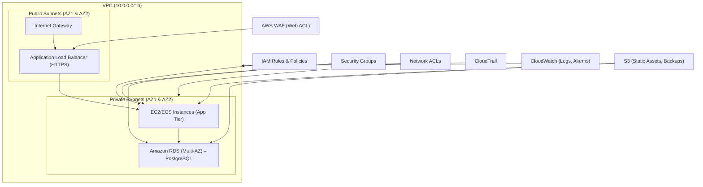

# Part B – Secure AWS Architecture Design

**Total Marks: 25**

## Architecture Overview
The proposed architecture follows a classic three‑tier, multi‑AZ design with defense‑in‑depth security controls.

### Key Services & Justification
- **VPC, Subnets, IGW, NACLs** – Isolate public‑facing load balancer from private application and database tiers.
- **ALB (HTTPS)** – Centralised TLS termination; integrates with WAF.
- **AWS WAF** – Protects against OWASP Top 10 attacks (SQLi, XSS, etc.).
- **EC2/ECS‑Fargate** – Compute for the web application; can be swapped later.
- **Amazon RDS (Multi‑AZ, encrypted)** – Managed relational DB with automated backups and high availability.
- **IAM least‑privilege roles** – Fine‑grained permissions for each component.
- **Amazon S3 (server‑side encryption)** – Stores static assets and backup snapshots.
- **CloudTrail & CloudWatch** – Auditing, logging, and alerting for security events.
- **Encryption at rest & in transit** – KMS‑managed keys for RDS, S3, and TLS for ALB.

---
